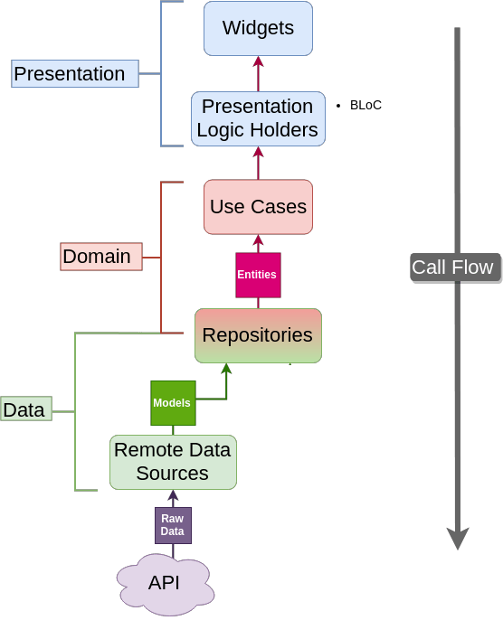
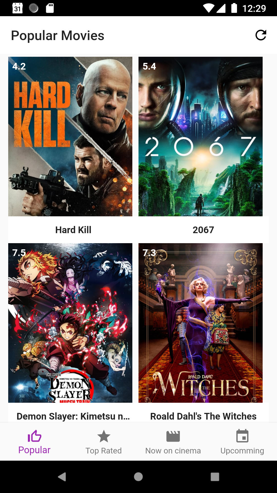
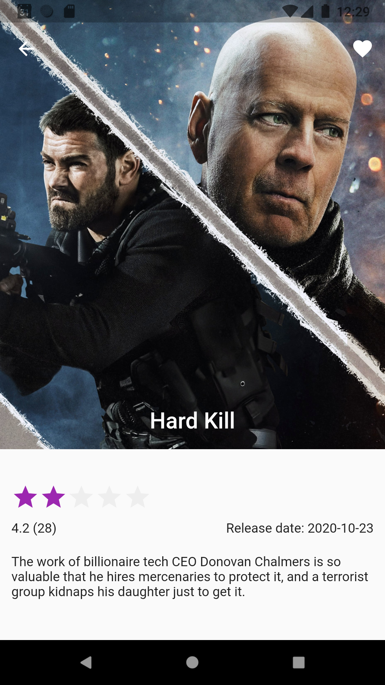

# Movie App
The Movie Database - Flutter - TDD - Clean architecture

## Architecture
This application tries to implement a clean architecture and test development TDD.
The project follow the guidlines proposed by Matt Rešetár from ResoCoder.

## The Movie Database
Because all code is decouple, the dependency to a The Movie Database only depends on the last data layer. If in the future we want to change the repository to another service or to a database we have to change onle DataSource file to point to the new source and Model file if we get differen field names or another type fo file insted of a json file like xml.

## Screens
I added only 2 screens:

### List of Most Popular Movies

Here we can see the list of most popular movies with the name and the score.

### Movie details

For each movie we can see it's details

## Workflow

### Future work
- Add pagination
- Add missing tabs with different movie lists
- Get details for each movie

